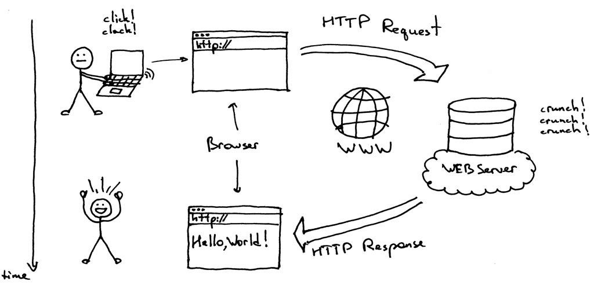

1在php中对数组有着丰富的函数，array_merge()是 将一个或多个数组的单元合并起来，一个数组中的值附加在前一个数组的后面。返回作为结果的数组.

```php
<?php
$array1 = array("color" => "red", 2, 4);
$array2 = array("a", "b", "color" => "green", "shape" => "trapezoid", 4);
result = array_merge(array1, $array2);
print_r($result);
/* 结果将得到：
  Array
  (
      [color] => green
      [0] => 2
      [1] => 4
      [2] => a
      [3] => b
      [shape] => trapezoid
      [4] => 4
  )
  */
?>
```

你们尝试用已学的知识去构造这个函数:

参考答案：

```php
   //构建函数
     function my_array_merge($array1, $array2) {
      	foreach ($array2 as $key => $value) {
      		//基础的
   	  		$array1[$key] = $value;
         }
   	  	return $array1;  	
     }
	
	//参数很多
		function my_array_merge($array1, $array2) {
          	$args = func_get_args();
          	$array = array_pop($args);
            foreach($args as $value)
              foreach($value as $key => $val) {
                $array[$key] = $val;
              }
        }
```


3 现在网校为了方便大家交流学习知识，需要做一个校园博客平台。请你根据以下需求设计一个合理的数据库。 

需求： 

1. 大佬可以用自己的账号登录系统写博客 
2. 游客可以对任意一篇博客点赞 
3. 每篇博客需要显示标题、文章类型、内容、发表时间、点赞数量、博主 
4. 游客可以根据文章类型查看该类型所有博客 
5. 游客可以查看博主的信息（账号名、姓名、电话） 

说明： 

1. 用设计范式对表设计进行检验 

2. 每个字段选择合适的数据类型 

3. 写出第3个需求的sql语句

   参考答案

```sql
CREATE TABLE `article` (
  `article_id` int(11) unsigned NOT NULL AUTO_INCREMENT,
  `title` varchar(255) DEFAULT NULL,
  `content` text,
  `created_time` timestamp NULL DEFAULT NULL ON UPDATE CURRENT_TIMESTAMP,
  `dl_id` int(11) DEFAULT NULL,
  `praise_num` int(11) unsigned DEFAULT NULL,
  `state` tinyint(2) DEFAULT '1',
  PRIMARY KEY (`article_id`)
) ENGINE=MyISAM DEFAULT CHARSET=utf8;
/*文章content一般很长所以使用text类型存储，还有时间大多时候选择timestamp 大概记住下， state在这里用于软删除的实现，有兴趣的可以查查软删除的概念 */
/*用户表，像密码因为要进行hash加密，所以加密后的长度固定，所以用char类型。int类型他不是无限长的，他最多是11位来着，这个大概了解下，还有就是加索引，如果学有余力的可以先看下吧*/
CREATE TABLE `dalao` (
  `dl_id` int(11) NOT NULL AUTO_INCREMENT,
  `dl_name` varchar(30) CHARACTER SET utf8 COLLATE utf8_unicode_ci NOT NULL,
  `dl_password` char(64) DEFAULT NULL,
  `mobilephone` bigint(11) unsigned NOT NULL,
  `nickname` varchar(30) NOT NULL,
  PRIMARY KEY (`dl_id`),
  UNIQUE KEY `nickname` (`nickname`) USING BTREE
) ENGINE=MyISAM DEFAULT CHARSET=utf8;

SELECT 
`article`.article_id, 
`article`.title, 
`article`.created_time, 
`article`.praise_num, 
`dalao`.nickname 
FROM `article` 
INNER JOIN 
`dalao` 
ON 
`article`.dl_id = `dalao`.dl_id;
```
6这是一个名字为*students*的表

| id   | username | stuId      |
| ---- | -------- | ---------- |
| 1    | 李小明      | 2015210333 |
| 2    | 李小红      | 2015210366 |
| 3    | 李小华      | 2015210344 |
| 4    | 张小明      | 2015210444 |
| 5    | 杨小明      | 2015211412 |
| 6    | 陈明       | 2015213112 |
| 7    | 陈小明      | 2015212134 |

**写出下列要求的 sql语句**

- 搜索所有id小于4的同学的所有字段

- 搜索所有学号前缀为*2015210*的同学的*usename*和*stuId*字段

- 搜索所有名字中含有 *明* 的*usename*和*stuId*字段

  参考答案

```sql
SELECT * FROM students WHERE id < 4;
SELECT username,stuid FROM  students WHERE id like '2015210%';
SELECT username,stuid FROM  students WHERE username like '%明%'
/*这里主要考了模糊查询， 记住一些占位符的意思 区别 %和_*/
```
7 下列代码输出内容是


```php
<?php 
class A{ 
    public function __construct(){ 
        echo "Class A...<br/>"; 
    }
}
class B extends A{
    public function __construct(){
        echo "Class B...<br/>"; 
    }
}
    new B();
?>
```

是类的重载问题，具体的看文档。参考答案：Class B...

10 在浏览器地址栏输入一个网址到显示网页的过程中（假设是个PHP网页），浏览器,服务器和php程序是怎么相互配合工作的。

 http://developer.51cto.com/art/201007/209634_all.htm 可以自己看下。

也可以参考下面

当我们在浏览器输入URL后，浏览器会先请求DNS服务器，获得请求站点的 IP 地址。然后发送一个HTTP Request（请求）给拥有该 IP 的主机，接着就会接收到服务器给我们的 HTTP Response（响应），浏览器经过渲染后，以一种较好的效果呈现给我们。这个过程中，正是Web服务器在幕后默默做贡献。

​	

#### 关于php解析

##### php：服务器会根据请求调用相应的web程序(这里指php程序)去获取页面显示的必须资源，然后web程序动态地生成html文件后，服务器会将其返回给客户端，从而完成一次响应


11

```php
   <?php 
       class Person
       {
          public $name;  //姓名
          public $sex;  //性别
          public $age;  //年龄
          public $height;  //身高
          public $temperament;  //性格
       }

       interface Introduction
       {
          function introduce();  //介绍
       }
```


 写一个男朋友(BoyFriend)或女朋友(GirlFriend)类,如果没有可以自己想象嘛

   要求:

- 继承上面的Person类并实现Introduction接口
- 使用魔术方法__construct为成员赋值
   - 可自定义其他成员或方法，使自我介绍清晰完整
   - 让你的男/女朋友自我介绍，写出运行结果（提示：创建一个新的对象后调用introduce()方法）

```php
<?php 
    class Person
    {
       public $name;  //姓名
       public $sex;  //性别
       public $age;  //年龄
       public $height;  //身高
       public $temperament;  //性格
    }

    interface Introduction
    {
       function introduce();  //介绍
    }
//懂得类的继承和接口的继承的语法
class GirlFriend extends Person implements Introduction
{
	public function __construct($name, $sex, $age, $height, $temperament)
	{
	    $this->name = $name;
      	$this->sex = $sex;//后面的应该一样的写
      	 
	}
    public function introduce()
    {
        echo"$this->name is my girlfriend.";//这个乱写的
    }
}

$gf = new GirlFriend('heh', 'nv', '18', '124', '2131');
$gf->introduce();
```
15用php写一个函数

1. 写一个函数；传入一个数组，返回一个含有传入数组所有键名的数组；
2. 写一个函数；传入一个数组，传入一个指定值（如字符串）；返回指定值的键名；
3. 以上两个函数合并为一个函数，当不传入第二个参数时返回（1）的结果；当传入第二个参数时，返回（2）的结果。

例子：

```php
$arr = [
     'color1' => 'red', 
     'color2' => 'blue', 
     'color3' => 'green', 
     'color4' => 'blue'
];
arr_keys($arr)         // 返回 ['color1', 'color2', 'color3', 'color4'];
arr_keys($arr, 'blue')  // ['color2', 'color4'];
```


参考答案

```php
function my_array_keys($array) {
  $keys = [];
  foreach($array as $key => $value) {
    $keys[] = $key;
  }
  return $keys;
}

function my_array_search($array, $search) {
  foreach($array as $key => $value) {
    if($search == $value) {
      return $key;
    }
  }
  return false;
}

function my_function($array, $search=null) {
  $keys = [];
  foreach($array as $key => $value) {
    if (is_null($search)) {
      $keys[] = $key;
    }elseif($search == $value) {
      return $key;
    }
  }
	return is_null($search) ? $keys : false;
}
```


16

才高考完的李华想写一个简单的登录验证。他在后端接受表单提交的数据代码如下

```php
<?php
    $username = $_POST['username'];
    $password = $_POST['password'];

    $db = new PDO("mysql:hots=localhost;dbname=class","root","root");
    $find = $db->prepare("SELECT password form user_info where username=:username");
    //$find->blindParam(":username",$username);
	$find->bindParam(":username",$username);		//是bind绑定，不是blind
    $find->execute();
    $find->setFetchMode(PDO::FETCH_ASSOC);

    $result = $check->fetch();

    if($password == $result['password'])

       // echo "<script>alert("success");</script>";题目引号闭合有问题，注意下
       echo "<script>alert(\"success\");</script>";

    else
    echo "<script>alert(\"success\");</script>";
        //echo "<script>alert("failed");</script>";//题目引号闭合有问题，注意下

?>
```

但是当他用户名和密码输入为空的时候，却验证登录成功了。请你帮帮他改下代码。（PS：李华说高考完了我也跟你们没完。你有本事帮我写英语作文，你有本事帮我改代码啊，雪姨敲门.jpg）


参考答案

```php
$username = $_POST['username']; 
$password = $_POST['password'];
if (empty($username) || empty($password)) {
  echo "<script>alert(\"empty\");</script>";	//~~~你们可以查查is_null empty isset的区别
}
$db = new PDO("mysql:hots=localhost;dbname=class","root","root");
$find = $db->prepare("SELECT password form user_info where username=:username");    
$find->bindParam(":username",$username);
$find->execute();
$find->setFetchMode(PDO::FETCH_ASSOC);
$result = $check->fetch();

if($password === $result['password'])	//这里也可以用三个等于判定，二个等于和三个等于区别自己百度吧。

  echo "<script>alert(\"success\");</script>";
else
  echo "<script>alert(\"failed\");</script>";

```

